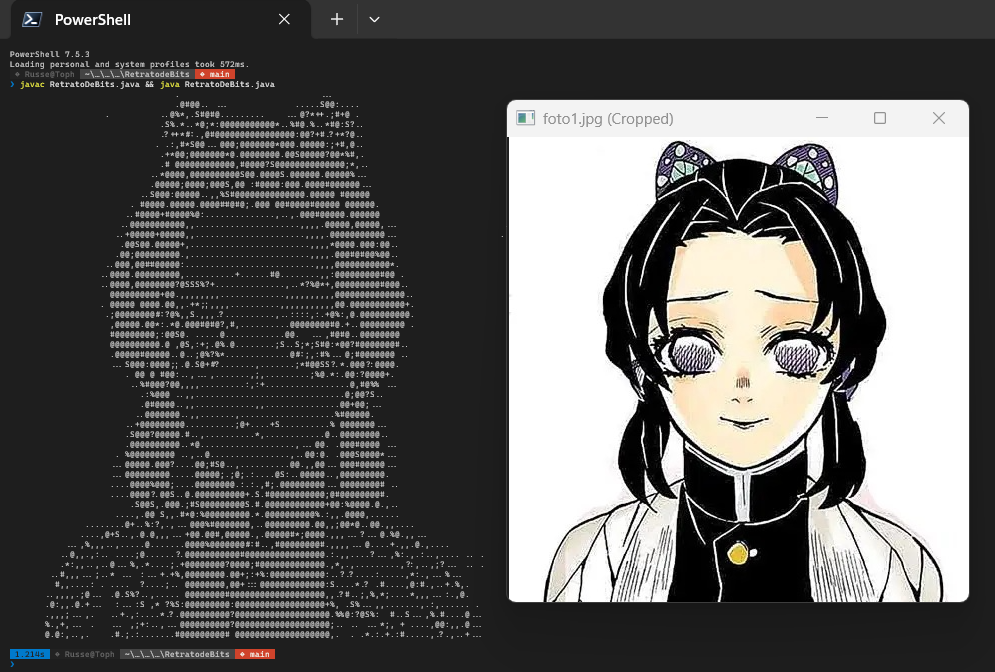

# RetratodeBits



## Ejecución Rápida

### Opción 1: Scripts automatizados
Para compilar, ejecutar y limpiar automáticamente:

**Windows:**
```bash
run.bat
```

**Linux/Mac:**
```bash
chmod +x run.sh
./run.sh
```

### Opción 2: Compilación manual
Abre tu terminal y compila el nuevo archivo:

```bash
javac RetratoDeBits.java
```

## Ejecuta

```bash
java RetratoDeBits
```

**Nota:** Los scripts automáticos (`run.bat` y `run.sh`) compilan, ejecutan el programa y eliminan automáticamente el archivo `.class` generado para mantener el directorio limpio.